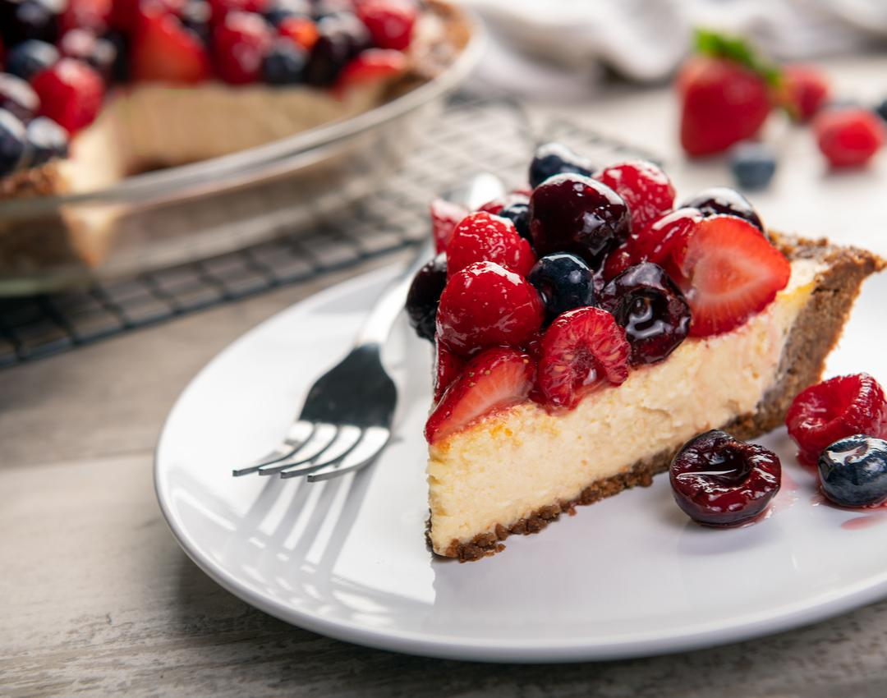
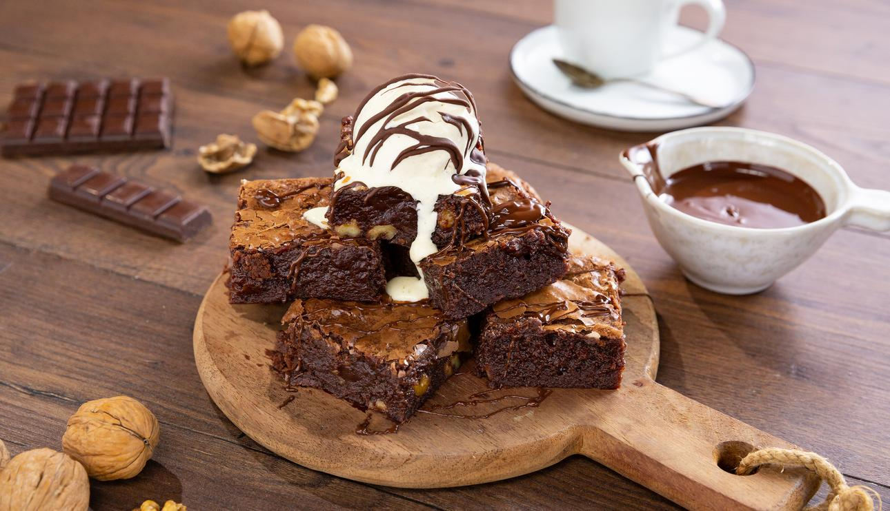

<!DOCTYPE html>
<html lang="es">
<head>
  <meta charset="UTF-8">
  <title>Coffejeji</title>
</head>
<body>
  <header>
    <h1> COFFEEJEJI</h1>
    <nav>
    <a href="index.html">Inicio</a> |
    <a href="Carta.html">Carta</a> |
    <a href="contacto.html">Contacto</a> |
    <a href="historia.html">Historia</a>
    </nav>
  </header>

  <section>

    
    <h2>Bienvenido a coffeejeji</h2>
    
Aqui se sirven momentos y se preparan sonrisas.

  </section>

  <section>
    <h2>Nuestra carta</h2>

    <article>
      
      <h3>Capuchino - $10</h3>
      
Equilibrio perfecto entre intensidad y suavidad.

    </article>

    <article>
      
      <h3>Cheesecake - $15</h3>
      
Delicado y cremoso.

    </article>

    <article>
      
      <h3>Brownie- $10</h3>
      
Suave y esponjoso.

    </article>

    
<a href="carta.html">Ver la carta completa→</a>

  </section>
  
  <section>
    <h2>Prueba el mejor cafe</h2>
    <article>
      
      <h3>Café Americano - $10</h3>
      
Si disfrutas el Café, no puedes dejar de probar nuestro americano, asi como los mejores acompañamientos como Galletas o Kekes especiales que tenemos para ti .

    </article>
  </section>
</body>
</html>
